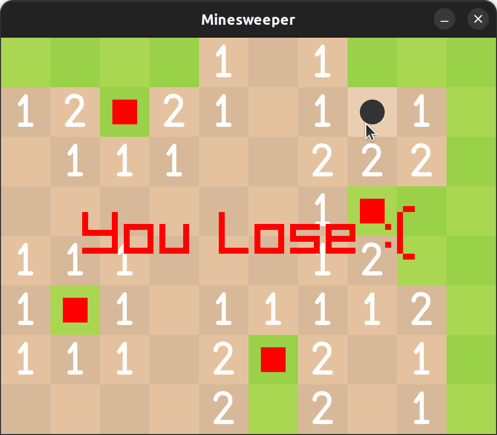

# Uiua Minesweeper

Made using [Iris](https://github.com/Marcos-cat/iris)

The game takes three optional commandline arguments.

1. The number of tiles in the format `NxM`
2. The number of bombs
3. The number of pixels per tile

